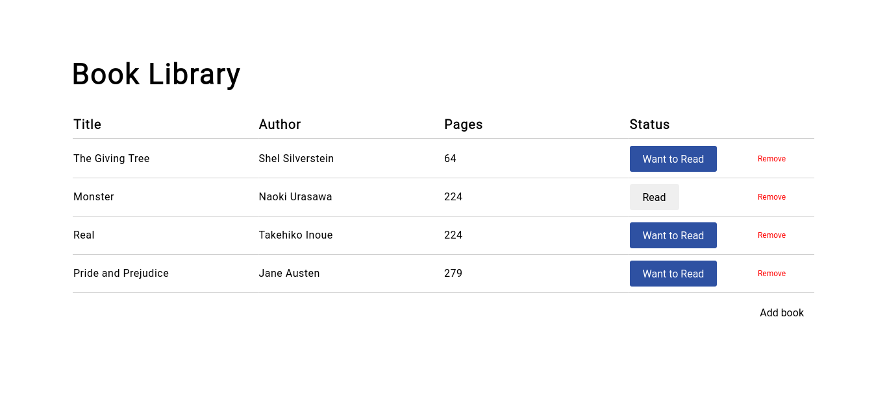

 # Library app
Getting my feet wet with object-oriented paradigm by making an object-oriented library app

 ## Preview
 Start tracking your books by clicking [this]https://neil-justin.github.io/library-app/)

 ## Objectives
- Store each book in an object (that is initialized using object constructor) and store all of them in a single array.
- Dynamically display the inputted books in a table-like manner.

## Acknowledgement
- This project was made possible by [The Odin Project](theodinproject.com) — a community-supported, open-source website that teaches full-stack web development for free.